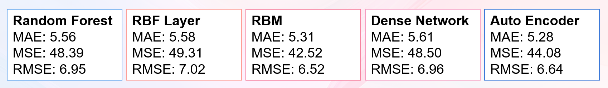
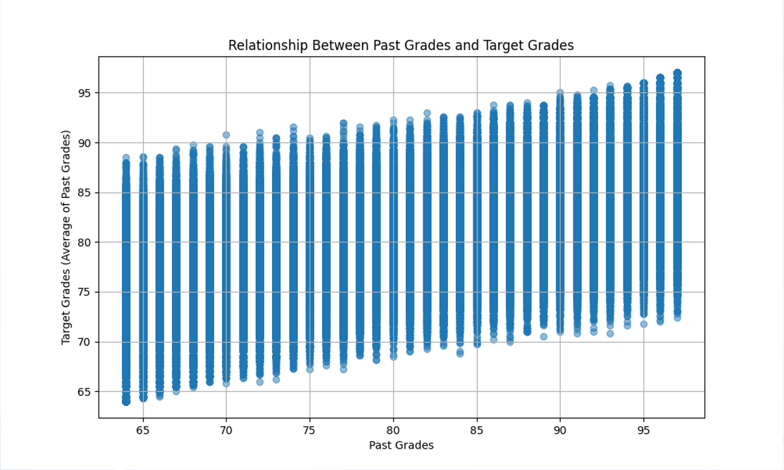
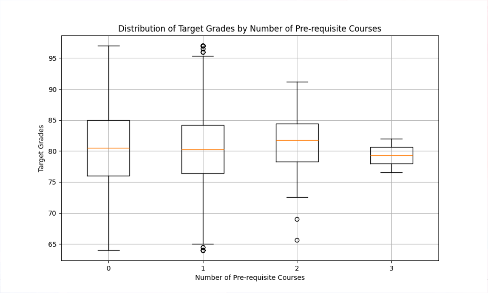
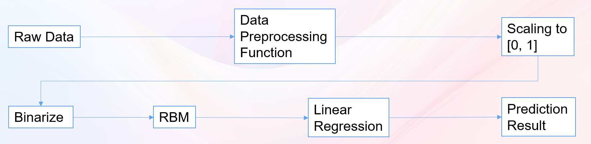

# 基于RBM的学生成绩预测模型

## 简介
基于学生信息管理系统之上，部署的一种学生成绩预测模型，在运行本系统的前端和后端之后，还需要运行python服务器文件，才可以在选课时预测学生未来的期末成绩。

使用了多种机器学习算法，最后选择了RBM算法，这是由于在比较其他四个时，RBM不仅有相对简单的复杂度，而且还有相对高的准确率。

具体我们从三种计算损失的角度来分析不同的算法精度在1000个数据中，分别是MAE（Mean Absolute Error），MSE(Mean Square Error), RMSE(Rooted Mean Square Error)

## 数据准备
数据集均为人为随机生成，但是在训练集的训练中，我们在图中可以看到过去的分数越高那么预测分数也会较高。

我们还在预测成绩中加入了前置课的选项，在一些学生刚开始上一节课时，模型会对这节课的前置课来预测未来的成绩，越多的前置课数据，那么预测结果也会相对集中。

## 项目说明

### 项目具体工作流程
1.首先，管理员要在后端项目中开启选课的操作。

2.随后，在随后选课时间开放内学生在选课时会对选择课程时在页面上方弹出预测成绩的具体信息。

### 项目实施流程
下面是具体的工作运行流程，如下图所示：

